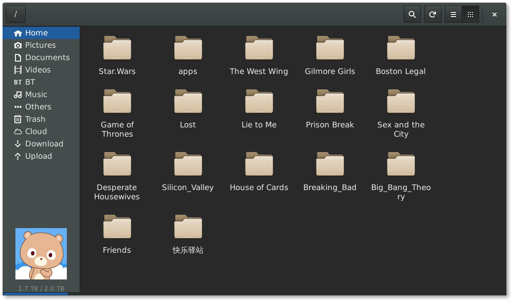
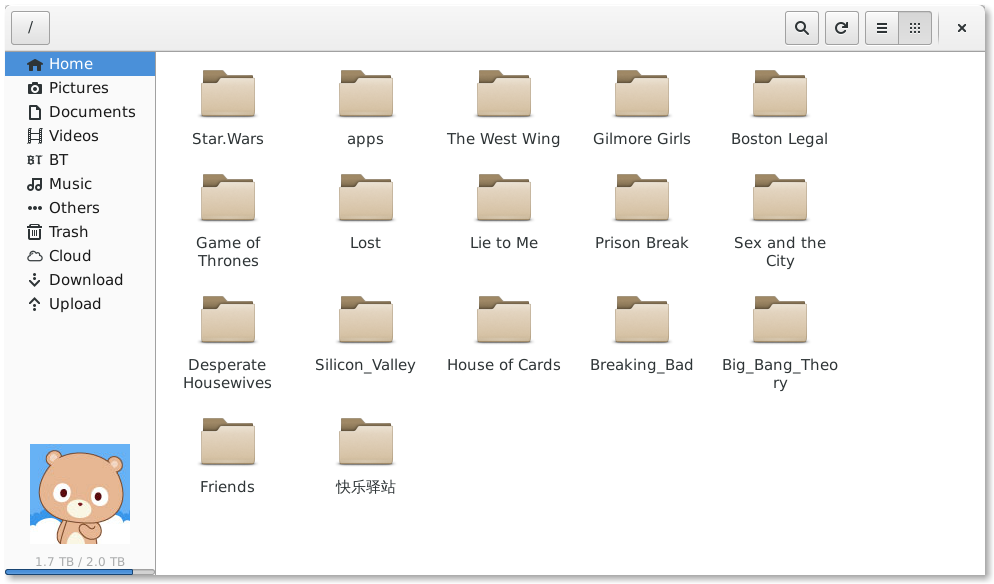

关于
=====
bcloud 是[百度网盘](http://pan.baidu.com)的Linux桌面客户端.

已经支持的Linux系统/版本:

* ArchLinux
* Debian sid
* Debian testing
* Debian stable
* Fedora 20
* Fedora 21
* Gentoo
* OpenSuse 13
* Ubuntu 14.04
* Ubuntu 13.10
* Linux Mint 17

类似项目
=======
[bypy](https://github.com/houtianze/bypy) 终端里使用的百度网盘客户端, 它
使用了百度网盘PCS接口.

如果需要, 也可以直接调用bcloud提供的百度网盘接口, 使用bcloud/auth.py得到百度
服务器的连接授权, 然后使用bcloud/pcs.py调用相应的网盘接口.

安装
=======
请用户直接到 [bcloud-packages](https://github.com/LiuLang/bcloud-packages)
下载发行版相对应的安装包, 比如deb, rpm等..

Q&A
===
1.为什么bcloud不支持本地与远程服务器同步?

因为百度网盘没有公开它的同步算法. 参考这个[issue](https://github.com/LiuLang/bcloud/issues/11)

2.能不能支持其它网盘?

我时间和精力都非常有限, 单单开发bcloud就占用了我一个多月的业余时间. 而且
本来工作之外的时间就非常少, 还有很多其它事情要处理. 所以如果你报告了bug或者
反馈了问题, 没有及时收到回复, 请多等待一下, 我会安排时间处理这些问题的.

3.如何设置keyring?
ArchLinux 用户最有可能遇到这个问题. 因为在debian/ubuntu/mint等系统里面, keyring
在安装后会自动被配置好, 而在arch中, 这些都需要用户手动设定, 很麻烦.

arch的wiki里面有完整的介绍, 请arch用户到[这里](https://wiki.archlinux.org/index.php/GNOME_Keyring)
读完整篇文章, 然后针对自己的桌面环境以及自己的需要, 选择相应的配置方式.

还有一篇类似的文档, 是gnomekeyring官方的, 有也相应[介绍](https://wiki.gnome.org/action/show/Projects/GnomeKeyring?action=show&redirect=GnomeKeyring#Automatic_Unlocking)

有位朋友写了一篇文章, 大致总结了一下他[解决gnome-keyring问题的方法](https://bbs.archlinuxcn.org/viewtopic.php?pid=20918), 如果arch用户还有什么细节上的问题, 可以
直接@Firef0x, 和他联系.

4.为什么不同的发行版里面, bcloud的界面不一样?
bcloud目前已经开始调用gtk3.12中的组件, 这样与新版gnome-shell的样式更统一;
但旧的发行版, 比如debian 7等, 里面的gtk3的版本很老, 只能继续使用旧的界面了.
它们在功能上并无差别.

5.有命令行界面吗?
bcloud只提供了GUI界面. 但是, 可以很方便的基于bcloud进行扩展, bcloud实现了百度网
盘的大部分接口, 其中bcloud/auth.py用于授权登录, bcloud/pcs.py是网盘接口.

比如, [这个issue](https://github.com/LiuLang/bcloud/issues/47)里面,
通过调用bcloud, 来遍历网盘, 得到文件目录结构.

6.如何设置代理?
bcloud支持桌面的全局代理设置, 比如在Gnome的网络设置里面可以加入代理.
也可以在终端里设置代理, 比如 `export http_proxy='http://127.0.0.1:8086'` 来设定
http代理, `export https_proxy='http://127.0.0.1:8086'` 来设定https代理, 设定完
之后, 在这个终端里运行 `$ bcloud-gui`, 这时, bcloud就会使用刚刚设定的网络代理.

要注意的是, bcloud的部分网络连接要求使用https, 这就要求你设定https代理后, 同时
导入相应的证书, 不然会出现错误.

7.bcloud播放在线视频时如何更流畅?

用视频播放器播放百度网盘视频时, 百度会识别UA字段.
[这位朋友写了mpv的修改方法](http://imzf.gitcafe.io/2015/04/05/%E8%AE%A9-BCloud-%E6%92%AD%E6%94%BE%E8%A7%86%E9%A2%91%E6%9B%B4%E6%B5%81%E7%95%85/),
可以参考一下.

截屏
====

版权
====
Copyright (C) 2014 [LiuLang](mailto:gsushzhsosgsu@gmail.com)

基于GNU通用许可协议第三版发布, 详细的许可信息请参考 [LICENSE](LICENSE)
