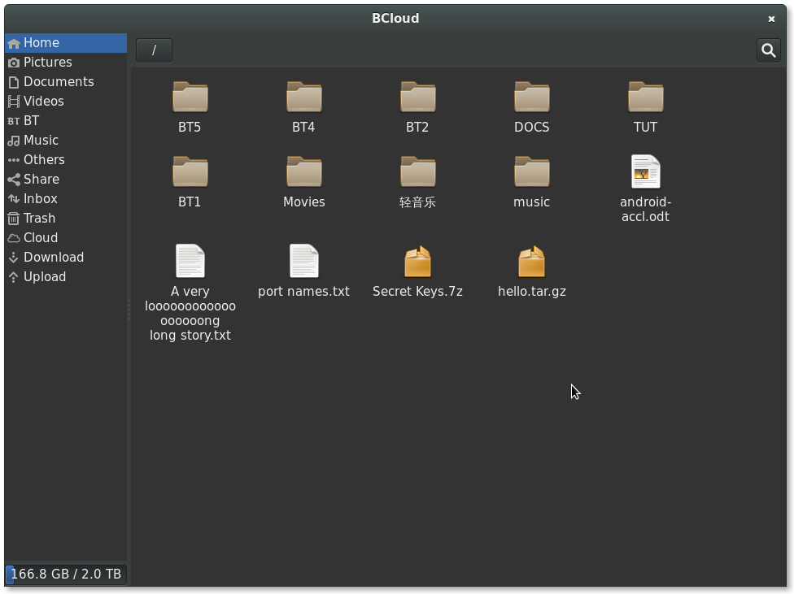

ABOUT
=====
bcloud 是[百度网盘](http://pan.baidu.com)的Linux桌面客户端.

已经支持的Linux系统/版本:

* ArchLinux
* Debian sid
* Debian testing
* Debian stable
* Fedora 20
* Gentoo
* OpenSuse 13
* Ubuntu 14.04
* Ubuntu 13.10
* Ubuntu 12.04

类似项目
=======
[bypy](https://github.com/houtianze/bypy) 终端里使用的百度网盘客户端, 它
使用了百度网盘PCS接口.

如果需要, 也可以直接调用bcloud提供的百度网盘接口, 使用bcloud/auth.py得到百度
服务器的连接授权, 然后使用bcloud/pcs.py调用相应的网盘接口.

安装
====
请用户直接到 [bcloud-packages](https://github.com/LiuLang/bcloud-packages)
下载发行版相对应的安装包, 比如deb, rpm等.

如果需要手动安装的话, 也可以用pip3来安装, 比如: `# pip3 install bcloud`

如果不想安装安装, 请至少把blcoud/share目录合并到~/.local/share, 不然图标会显示不全.

DEPENDENCIES
===========

* python3-gi  Gtk3 的python3 绑定. 这个包需要手动安装gir1.2-gtk-3.0, 但它并
没有把这个依赖关系写清楚, 详细情况请看 [issue 5](https://github.com/LiuLang/bcloud/issues/5)
* gnome-icon-theme-symbolic Gnome3 提供的一套按纽.
* python3-keyring  这个模块是推荐安装的, 用于把帐户的密码存放到
* python3-dbus  dbus的python3绑定, 如果在密码时超时, 会产生一个dbus.exceptions.Exception异常.
* python3-lxml 强大的XML解析器, 可以在[这里](https://pypi.python.org/pypi/lxml)下载.
* python3-cssselect CSS3 属性选择器, 在[这里](https://pypi.python.org/pypi/cssselect).
* python3-crypto  使用RSA算法加密用户密码.
gnome-keyring或kwallet里面; 如果缺少了这个模块, 帐户的密码就会被明文存储!
* gir1.2-notify 这个是GtkNotification的接口, 显示桌面消息通知

Q&A
===
1.为什么bcloud不支持本地与远程服务器同步?

因为百度网盘没有公开它的同步算法. 参考这个[issue](https://github.com/LiuLang/bcloud/issues/11)

2.能不能支持其它网盘?

我时间和精力都非常有限, 单单开发bcloud就占用了我一个多月的业余时间. 而且
本来工作之外的时间就非常少, 还有很多其它事情要处理. 所以如果你报告了bug或者
反馈了问题, 没有及时收到回复, 请多等待一下, 我会安排时间处理这些问题的.

关于 115 网盘, 前段时间写了一个[油猴脚本](https://github.com/LiuLang/monkey-videos/tree/master/115),
可以用它来直接观看网盘里的视频, 这个脚本属于[monkey-videos](https://github.com/LiuLang/monkey-videos)项目.

COPYRIGHT
========
Copyright (C) 2014 [LiuLang](mailto:gsushzhsosgsu@gmail.com)

基于GNU通用许可协议第三版发布, 详细的许可信息请参考 [LICENSE](LICENSE)

SCREENSHOTS
==========

